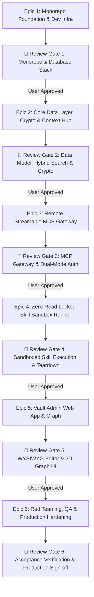

# Master Production Execution Plan: tkxel Vault

> [!WARNING]
> **Production sign-off reopened on 2026-09-16.** This file records the original build plan and historical review gates. Its approval markers are not current compliance evidence. Continue with [SENIOR_REVIEW_REMEDIATION_PLAN.md](./SENIOR_REVIEW_REMEDIATION_PLAN.md) and use [CODEX_MEMORY.md](./CODEX_MEMORY.md) for the audited handoff state.

This document defines the authoritative, production-grade engineering roadmap for **tkxel Vault**, broken down into **6 Sequential Epics** and **24 Atomic Chunks**.

---

## 🛡️ Architecture and Threat-Model Baseline

This baseline establishes the foundational security invariants and architectural bounds derived from [tkxel_vault_SRS.md](./tkxel_vault_SRS.md):

1. **Custom-Built Context Hub:** Developed completely independently under tkxel ownership. There is **zero dependency** on GBrain or Obsidian. Obsidian is supported exclusively as an import file format (Markdown, YAML front matter, tags, formatting, wiki-links) and as UX inspiration.
2. **Open vs. Locked Vault Boundaries:**
   - **Open Vaults:** Readable and searchable by authorized Readers via web UI and Claude retrieval tools.
   - **Locked Vaults:** Zero-read protection for proprietary IP. Consumers execute skills (`run_skill`) and submit questions (`ask_vault`) without direct access to source files, file names, paths, directory listings, raw Markdown, or unauthorized metadata.
3. **Controlled Administrative Workflows:** Owners and assigned Editors manage locked vault content through dedicated, controlled administrative workflows in the web app. All authorization checks are enforced **server-side on every request**.
4. **Export Policy Enforcement:**
   - **Open Vaults:** Export is restricted strictly to Owners, produces an audited ZIP archive, and logs a complete audit event.
   - **Locked Vaults:** Export is **strictly prohibited for every role**, including Owners and System Administrators. All UI, API, and MCP export paths are denied by design.
5. **Security Realism & Threat Boundaries:**
   - The platform guarantees that direct source access is prevented through tested product interfaces.
   - Documented systemic limitations: Generated outputs from locked skills are visible to users and can be copied; sequential questioning may allow indirect partial knowledge reconstruction (mitigated by rate limiting and anomaly alerting, but not mathematically eliminated); data processed by Claude passes through Anthropic API compute during inference; and screenshot capture cannot be prevented.
6. **Defense-in-Depth Data Isolation:** Access checks are never client-side or simple application-level filters; they require server-side authorization on every request combined with PostgreSQL Row-Level Security (RLS) or an equivalent documented defense-in-depth data isolation control.
7. **ADR-Backed Decisions:** Technology selections not explicitly frozen in the SRS (such as specific ORM, headless editor library, 2D graph engine, container sandbox runtime, Cloud KMS provider, and corporate SSO provider) are governed by formal Architecture Decision Records (ADRs).

---

## 🛑 Epic Review Gate Protocol (Mandatory)

> [!IMPORTANT]
> **At the conclusion of each Epic, execution MUST STOP.**
> 1. **Automated Verification:** All unit, integration, and security tests for that Epic must pass cleanly.
> 2. **Walkthrough & Verification Artifact:** The agent presents a structured walkthrough detailing changes, test commands, and execution evidence.
> 3. **Formal User Review & Sign-Off:** **The agent stops and waits for explicit user review and approval.**
> 4. **Living Ledger Sync:** [PROJECT_MEMORY.md](./PROJECT_MEMORY.md) is updated with milestone deliverables and decisions.
> 5. **Gate Approval:** Work on subsequent Epics shall not begin until explicit approval is granted.

---

## 🧭 Execution Sequence & Review Gates

---

## Detailed Work Breakdown: 6 Epics & 24 Chunks

### Epic 1: Monorepo Foundation & Development Infrastructure
*Lead: Orchestrator & Master Planner*

- [x] **Chunk 1.1: Monorepo Workspace & Build Pipeline**
  - Initialize monorepo workspace (`pnpm-workspace.yaml`, `turbo.json`).
  - Configure root TypeScript configuration (`tsconfig.base.json`), ESLint, and Prettier.
  - Scaffold modular workspace layout:
    - `packages/types`: Shared domain interfaces, protocol types, and tool schemas.
    - `services/vault-core`: Storage engine, encryption, and Context Hub retrieval.
    - `services/mcp-gateway`: Remote Streamable HTTP MCP server.
    - `services/skill-runner`: Ephemeral sandbox execution service.
    - `apps/web-app`: Vault Admin Web Application.
- [x] **Chunk 1.2: Local Development Infrastructure (`docker-compose.yml`)**
  - Configure PostgreSQL 16 container with `pgvector` extension compiled and enabled.
  - Configure Redis container (for session caching, rate limiting, and sub-60s token revocation).
  - Configure local KMS mock service for AES-256-GCM envelope encryption development.
  - Add database health checks and connectivity verification scripts.
- [x] **Chunk 1.3: Shared TypeScript Domain Types & ADR Foundations (`packages/types`)**
  - Define core TypeScript domain interfaces reflecting SRS Section 6: `Vault`, `Page`, `Version`, `Link`, `TimelineEntry`, `Chunk`, `Skill`, `Share`, `AuditEvent`.
  - Define export policy enums: `ExportPolicy` (`allowed_for_owner`, `strictly_forbidden`).
  - Define MCP tool request/response schemas for both Open retrieval and Locked execution tools conforming to Anthropic MCP (version 2025-11-25).
  - Document initial ADR templates in `docs/adr/`.

> 🛑 **Review Gate 1:** Verify container orchestration, database connectivity, `pgvector` vector extension readiness, and clean compilation of shared packages. **[APPROVED]**

---

### Epic 2: Core Data Layer, Cryptography & Context Hub
*Leads: Backend & RAG Lead + Security & Crypto Lead*

- [x] **Chunk 2.1: Relational Schema Migrations & Defense-in-Depth Isolation**
  - Implement database schema via ORM (ADR-backed selection, e.g. Drizzle ORM / Prisma) reflecting all entities in SRS Section 6.
  - Implement defense-in-depth isolation controls: server-side authorization on every query combined with PostgreSQL Row-Level Security (RLS) policies enforcing vault boundaries.
  - Configure PostgreSQL `vector(1536)` and GIN `tsvector` columns and indices.
- [x] **Chunk 2.2: Cryptographic Envelope Service (KMS + AES-256-GCM)**
  - Implement per-vault unique data encryption key (DEK) generation.
  - Implement envelope key wrapping with Cloud KMS provider (AWS KMS / Azure Key Vault via ADR).
  - Implement in-memory encryption/decryption handling; ensure encryption keys are never persisted to disk or emitted in application logs.
- [x] **Chunk 2.3: Markdown Engine, Import Pipeline & Link Refactoring**
  - Implement native Markdown parser preserving YAML front matter, tags (`#tag`), and wiki-links (`[[target_page]]`).
  - Build universal import engine (`FR-07`): ingest single files, ZIP archives, and Obsidian vault exports with full preservation of formatting, front matter, tags, and internal links.
  - Build bidirectional link graph indexer (`from_page_id`, `to_page_id`, `resolved`).
  - Implement transactional rename cascade (`FR-12`): updating a page title atomically refactors all referencing links across the vault.
- [x] **Chunk 2.4: Versioning State Machine, Append-Only Audit & Export Engine**
  - Implement page draft/publish versioning state machine and line-by-line diff calculator.
  - Implement append-only structured audit logging service (`services/vault-core/src/audit/index.ts`).
  - Implement dual export policy engine (`services/vault-core/src/export/index.ts`): Open Vault Owner-only audited ZIP export; Locked Vault strict rejection for all roles.
- [x] **Chunk 2.5: Chunking, Embeddings & Hybrid Search Retrieval (`get_context`)**
  - Implement semantic sliding-window chunking preserving markdown structures.
  - Implement Reciprocal Rank Fusion (RRF) combining BM25 lexical rank with dense vector cosine similarity.
  - Implement `get_context` aggregation tool (`Section 5.1`): 1-hop link neighbor expansion, relevance ranking, and token budget packing under 500 ms p95.

> 🛑 **Review Gate 2:** Validate database migrations, RLS isolation policies, KMS envelope encryption, Markdown/Obsidian import fidelity, hybrid search benchmarks (<500ms), and strict export policy enforcement. **[APPROVED]**

---

### Epic 3: Remote Model Context Protocol (MCP) Gateway
*Lead: MCP Gateway Lead + Security & Crypto Lead*

- [x] **Chunk 3.1: Streamable HTTP Transport Engine (Anthropic MCP 2025-11-25)**
  - Implement compliant Streamable HTTP transport handling bidirectional JSON-RPC 2.0 frames.
  - Connect and register gateway as a Claude.ai custom connector (`FR-90` to `FR-93`).
- [x] **Chunk 3.2: Corporate SSO OAuth 2.1 PKCE Authentication & Fast Revocation**
  - Implement OAuth 2.1 PKCE bearer token validation with corporate OIDC identity provider claims (Google Workspace / Microsoft Entra ID via ADR).
  - Implement sub-60-second access revocation (`FR-54`) using Redis-backed token and permission invalidation.
  - Implement immediate SSO deprovisioning handler (`FR-55`).
- [x] **Chunk 3.3: Unified Dual-Mode Authorization Foundation & Open Retrieval Tools**
  - Build core gateway authorization engine enforcing server-side permissions for **both Open and Locked vault tools** dynamically per request.
  - Implement generic access denial responses (`FR-68`): suppress existence of unauthorized pages, skills, or vaults (generic `not_found` or `not_allowed`).
  - Implement open vault tools: `search`, `get_page`, `get_links`, `get_context`, and editor `add_note`.
  - Implement per-user rate limiting (`FR-67`) configurable per vault.

> 🛑 **Review Gate 3:** Validate Streamable HTTP protocol compliance via Anthropic MCP Inspector, test OAuth 2.1 PKCE authorization for both Open and Locked tool palettes, verify sub-60s access revocation, and confirm generic error suppression. **[APPROVED]**

---

### Epic 4: Zero-Read Locked Skill Sandbox Runner
*Leads: Runtime & DevOps Lead + Security & Crypto Lead*

- [x] **Chunk 4.1: Skill Package Loader, Manifest Validator & Parameter Schemas**
  - Validate Agent Skills package structure (`SKILL.md`, `tool.json`, scripts, templates).
  - Enforce strict parameter validation against declared `tool.json` schemas (`FR-32`).
  - Register skill metadata in database without exposing internal directory trees, file paths, or raw instructions.
- [x] **Chunk 4.2: Isolated Ephemeral Process / Container Sandbox**
  - Implement short-lived, isolated execution sandboxes (ADR-backed container runtime, e.g. non-root Docker / gVisor).
  - Enforce defense-in-depth execution constraints: non-root execution, default-deny outbound network egress (`FR-73`), minimal read-only filesystem, no host filesystem mounts, CPU/memory limits, and strict 120-second timeout (`FR-74`).
  - Ensure immediate environment teardown upon completion with no persistent volumes and no host credential exposure.
- [x] **Chunk 4.3: Secure In-Memory Orchestrator & Claude Messages API Connector**
  - Fetch vault encryption key ephemerally into volatile memory; decrypt locked skill payload within isolated runtime.
  - Orchestrate Claude Messages API invocation using server-managed credentials, injecting skill instructions as system prompt and validated user inputs as message content.
  - Ensure no secret logging, no disk writes of plaintext keys, and immediate process termination.
- [x] **Chunk 4.4: Locked MCP Tools Registration & Anti-Exfiltration Safeguards**
  - Expose locked tools on MCP Gateway: `list_skills`, `run_skill`, and `ask_vault`.
  - Implement output filtering and sanitization to ensure no direct source text, prompts, paths, filenames, directory listings, or unauthorized metadata are returned through supported interfaces.
  - Enforce strict denial of all export actions on locked vaults across all endpoints.

> 🛑 **Review Gate 4:** Execute end-to-end locked skill and `ask_vault` queries; verify user receives generated answers while direct source access is prevented through all supported interfaces; verify sandbox network isolation and immediate teardown. **[APPROVED]**

---

### Epic 5: Vault Admin Web App & 2D Knowledge Graph
*Lead: Frontend Lead + Documentation Lead*

- [x] **Chunk 5.1: Next.js/Vite App Shell, Authentication & Vault Mode Navigation**
  - Implement responsive dark-mode application shell with corporate SSO login flow.
  - Implement vault switcher and navigation tree with visual signifiers for Open Vaults (blue) vs. Locked Vaults (orange lock).
  - Enforce UI access boundaries: Readers browse Open Vaults; Consumers have zero web app access to locked contents; Owners and Editors access controlled administrative workflows for locked vaults.
- [x] **Chunk 5.2: Headless WYSIWYG Markdown Editor & Ingestion UI**
  - Integrate headless WYSIWYG editor (ADR-007) preserving clean Markdown and YAML front matter.
  - Implement interactive `[[` link picker with <50ms response time and alias resolution (`FR-03`).
  - Implement `#tag` autocomplete, page template picker (`FR-09`), and append-only timeline entry authoring.
  - Build universal import UI supporting drag-and-drop Markdown, ZIP files, and Obsidian vault packages (`FR-07`).
- [x] **Chunk 5.3: Interactive 2D Knowledge Graph Visualization**
  - Build force-directed 2D network graph (ADR-008: D3.js) rendering 2,000+ nodes at 60fps via Canvas / WebAssembly (`NFR-11`).
  - Implement node coloring by page type, tag filtering, search highlighting, and local two-hop neighborhood graph view (`FR-14`).
- [x] **Chunk 5.4: Access Sharing Modal, Export Controls & Audit Viewer**
  - Build role-based sharing modal (manage Editors, Readers, Consumers across individuals and SSO groups).
  - Implement Open Vault export interface for Owners (producing audited ZIP downloads).
  - Enforce Locked Vault export prohibition in UI: disable and omit all export options for locked vaults.
  - Build audit log dashboard (`FR-82`) with date, actor, and action filtering, plus CSV audit export.

> 🛑 **Review Gate 5:** Test interactive web application: note creation, link autocompletion, Obsidian import, 2D graph responsiveness, controlled locked administrative workflows, and audit log viewer. **[APPROVED]**

---

### Epic 6: Red Teaming, QA & Production Hardening
*Leads: Red Team & QA Lead + Documentation Lead*

- [x] **Chunk 6.1: Automated Anti-Exfiltration & Adversarial Testing Suite**
  - Implement automated test harness executing 20+ varied adversarial injection and exfiltration prompts against `run_skill` and `ask_vault`.
  - Validate tests proving no direct source text, prompts, paths, filenames, directory listings, or unauthorized metadata are returned through supported interfaces.
- [x] **Chunk 6.2: Multi-Tenant Cross-Vault Leakage & Error Suppression Tests**
  - Verify server-side authorization: user with access to Vault A cannot discover titles, snippets, or contents of Vault B under any query.
  - Verify generic authorization error suppression (`FR-68`): unauthorized requests return uniform errors without confirming resource existence.
- [x] **Chunk 6.3: Storage Ciphertext Audit & Dual Export Verification**
  - Automated inspection script checking raw database dumps and object storage blobs to confirm 100% ciphertext for page bodies, skill files, and chunks.
  - Automated export policy test: confirm Open Vault export succeeds for Owners with full audit logging, while Locked Vault export requests are strictly rejected across all API and administrative routes.
- [x] **Chunk 6.4: Architecture Decision Records (ADRs) & Production Runbooks**
  - Finalize all ADRs in `docs/adr/` (ADR-001 through ADR-009).
  - Author complete production operations runbook: KMS key rotation drills, database backup/recovery verification (RPO 24h, RTO 4h), and monitoring alert configuration.

> 🛑 **Review Gate 6:** The original sign-off was withdrawn on 2026-09-16 after a production-path review found isolation, storage, runner, retrieval, and assurance gaps. Those remediation criteria were subsequently accepted by the user on 2026-09-18; this does **not** approve Review Gates 7 or 8. See the production-integrity remediation plan.
