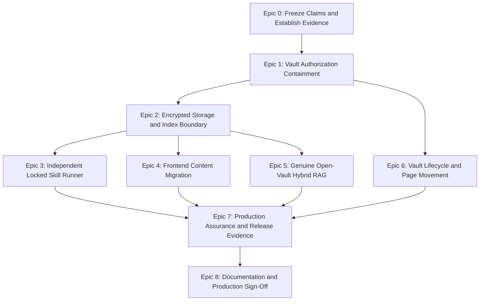

# tkxel Vault Bug Report & Remediation Plan

> **Program status:** Epic 0, Epic 1, Epic 2, Epic 3, Epic 4, Epic 5, and Epic 6 approved; Review Gate 3 explicitly approved following verified live Linux/gVisor runsc acceptance execution (25/25 checks passed); Review Gate 6 explicitly approved by the user on 2026-09-18. Epic 7 (Production Assurance and Release Evidence) is now unblocked.  
> **Created:** 2026-09-16  
> **Primary handoff:** [CODEX_MEMORY.md](./CODEX_MEMORY.md)  
> **Authority:** [AGENTS.md](./AGENTS.md), [tkxel_vault_SRS.md](./tkxel_vault_SRS.md), and [tkxel_vault_PRD.md](./tkxel_vault_PRD.md)

## 1. Purpose

This plan converts the senior-review findings and the 2026-09-16 repository audit into an executable remediation program. It supersedes the production-complete interpretation of Milestone 19. Existing implementation work is a useful starting point, but no security or compliance claim is accepted until a production-path test proves it.

The estimated Codex budget for the complete program is **400,000-500,000 tokens**, with **500,000 tokens** recommended to allow for database migrations, integration-test infrastructure, debugging, red-team cycles, and documentation reconciliation.

## 2. Non-Negotiable Release Invariants

1. Every operation is authorized for the exact requested vault, not merely for a tool name.
2. Locked-vault consumers can use only `run_skill` and `ask_vault`.
3. Locked vaults do not disclose raw content, titles, IDs, snippets, chunks, embeddings, links, filenames, paths, counts, or existence signals.
4. Page and skill content is protected at rest; no unapproved plaintext or readable content index is persisted.
5. Each vault has one unique DEK wrapped by an approved KMS provider; raw keys are never persisted or logged.
6. Production fails closed when identity, KMS, LLM, runner, or authorization dependencies are unavailable.
7. Every state-changing action and tool invocation emits an append-only audit event.
8. Acceptance evidence must exercise production modules, HTTP routes, PostgreSQL/pgvector, and rendered UI behavior.

## 3. Dependency Order

Work must stop at every epic gate. A later epic may not inherit an unverified security assumption from an earlier epic.

## 4. Epic 0 — Freeze Claims and Establish a Trustworthy Baseline

**Leads:** Orchestrator, QA/Red Team, Documentation  
**Goal:** Preserve the current worktree, expose known limitations, and create reproducible evidence.

### Chunk 0.1 — Worktree and Evidence Baseline

- [x] Capture `git status --short`, current branch/commit, runtime versions, and database migration state.
- [x] Preserve all pre-existing uncommitted changes; do not reset or overwrite them.
- [x] Run build and tests uncached and archive commands, package counts, failures, and warnings.
- [x] Classify existing tests as unit, source-inspection, component, integration, security, or end-to-end.
- [x] Record the current verified baseline in `CODEX_MEMORY.md`.

### Chunk 0.2 — Compliance Claim Freeze

- [x] Keep the SRS compliance report in `Remediation required` state.
- [x] Remove or qualify production-ready badges and 10/10 claims.
- [x] Make CI reject a production-sign-off document that lacks linked acceptance evidence.

### Review Gate 0

- [x] User approves the baseline and confirms that remediation may proceed on the dirty worktree.
- [x] No code behavior is claimed fixed solely because a source-regex or copied-logic test passes.

## 5. Epic 1 — Vault Authorization and Zero-Read Containment

**Leads:** MCP Gateway, Security/Crypto, QA/Red Team  
**Goal:** Close cross-vault and locked-vault disclosure paths before improving features.

### Chunk 1.1 — Central Vault Authorization Contract

- [x] Introduce one reusable authorization service accepting `userId`, `vaultId`, operation, vault mode, and required roles.
- [x] Remove hardcoded global-owner identities and require explicit production owner configuration.
- [x] Fail closed on missing vault context, database errors, invalid mode, or missing claims.
- [x] Return uniform `not_allowed`/`not_found` errors without resource-existence disclosure.
- [x] Set and verify PostgreSQL RLS session context for every relevant transaction.

### Chunk 1.2 — MCP Per-Vault Enforcement

- [x] Require explicit `vault_id` on every vault-scoped MCP operation.
- [x] Pass caller role context into every open and locked tool handler.
- [x] Verify the exact requested vault before calling the store.
- [x] Add vault predicates to `search`, `get_page`, `get_links`, `get_context`, and `add_note` queries.
- [x] Prevent graph traversal across vault boundaries.
- [x] Remove static default vault UUIDs from production paths.

### Chunk 1.3 — REST Locked-Vault Enforcement

- [x] Remove `consumer` access from pages, links, search, versions, timeline, audit, import, and export retrieval routes.
- [x] Confirm that locked-vault consumer content access is limited to `run_skill` and `ask_vault`; `list_skills` exposes only approved catalog metadata.
- [x] Validate vault mode independently of the role string.
- [x] Review skill-list behavior and expose only approved high-level metadata.

### Chunk 1.4 — Isolation Regression Suite

- [x] Run real HTTP requests as users assigned to Vault A against Vault B IDs and titles.
- [x] Test guessed UUIDs, aliases, page IDs, graph links, search terms, add-note calls, and error timing/body parity.
- [x] Verify immediate share revocation on the next request.
- [x] Test both REST and Streamable HTTP MCP paths against the production stores.

### Review Gate 1

- [x] Zero cross-vault reads, writes, metadata leaks, or existence oracles in the integration suite.
- [x] Locked consumers receive only the approved locked tool palette and cannot call retrieval endpoints.

## 6. Epic 2 — Encrypted Storage and Search-Index Boundary

**Leads:** Security/Crypto, Backend/RAG  
**Goal:** Establish a single documented protection boundary for bodies, chunks, embeddings, caches, and keys.

### Chunk 2.1 — ADR for Searchable Encryption Boundaries

- [x] Author an ADR defining protection rules for open-vault chunks, locked-vault chunks, lexical indexes, and embeddings.
- [x] Explicitly resolve the conflict between ciphertext-only storage and native PostgreSQL full-text/vector search.
- [x] Prohibit hosted embedding calls for locked-vault content.
- [x] Define approved client-cache behavior and key lifecycle.

### Chunk 2.2 — Server Storage Remediation

- [x] Remove plaintext body persistence from `pages.front_matter` and all compatibility write paths.
- [x] Remove or replace plaintext/readable `chunks.tsv_content` according to the accepted ADR.
- [x] Encrypt chunk text using the owning vault DEK.
- [x] Protect embeddings according to vault mode and the accepted threat model.
- [x] Fail a save/publish operation or enqueue a durable retry when required indexing fails; do not silently claim success.
- [x] Zero raw DEK buffers after the operation when practical.

### Chunk 2.3 — Browser Persistence Remediation

- [x] Stop serializing decrypted `Page.content` into plaintext `localStorage`.
- [x] Remove plaintext locked-vault caches entirely.
- [x] If offline open-vault support remains required, implement an approved encrypted cache and document its key lifecycle.
- [x] Remove cached bearer tokens from insecure persistence if the identity architecture does not explicitly approve it.

### Chunk 2.4 — Canary Ciphertext Audit

- [x] Insert unique canary content through real API routes.
- [x] Inspect raw tables, JSON fields, chunks, indexes, audit metadata, logs, browser storage, and exported artifacts.
- [x] Confirm that locked canaries cannot be discovered through search, error messages, or metadata queries.
- [x] Add the audit to CI using an ephemeral PostgreSQL/pgvector environment.

### Review Gate 2 (Approved by User 2026-09-16)

- [x] Approved ADR-017 exists and matches implementation (ADR-017 Accepted).
- [x] Raw-storage audit finds no prohibited canary content or readable locked-vault derivatives.
- [x] No plaintext client cache remains outside an explicitly accepted design.

## 7. Epic 3 — Independent Locked Skill Runner and Fail-Closed Providers

**Leads:** Runtime/Sandbox, Security/Crypto, MCP Gateway  
**Goal:** Make port 3003 a real isolated service and eliminate silent production fallbacks.

### Chunk 3.1 — Service Extraction

- [x] Move the port-3003 HTTP server into `services/skill-runner`.
- [x] Add service entry point, `dev`, `start`, readiness, and health commands.
- [x] Remove the second Express listener from `apps/api-server`.
- [x] Run the skill runner in a separate container/process with explicit resource and network policy.

### Chunk 3.2 — Authenticated Service-to-Service Contract

- [x] Define signed service identity between MCP gateway/API and runner.
- [x] Do not trust `x-user-id` as authentication.
- [x] Re-resolve or cryptographically bind user, vault, role, tool, and request expiry at the runner boundary.
- [x] Disable in-process runner fallback in production and fail closed when the runner is unavailable.

### Chunk 3.3 — Locked Execution Boundary

- [x] Load encrypted skill artifacts rather than plaintext instructions from metadata fields.
- [x] Decrypt only within the runner boundary and clean up plaintext/key buffers.
- [x] Enforce non-root execution, read-only filesystem, no host mounts, default-deny egress, CPU/memory limits, and timeout.
- [x] Ensure output sanitization and audit writes cannot disclose prompts, paths, or skill contents.

### Chunk 3.4 — LLM and KMS Production Policy

- [x] Permit mock LLM/KMS providers only through explicit test/development configuration.
- [x] Refuse production startup or return a clear unavailable state when approved providers are missing.
- [x] Never label a canned mock response as successful AI execution.
- [x] Add readiness checks for provider configuration without logging secrets.

### Review Gate 3 (Approved by User with Live WSL2/gVisor Evidence)

- [x] Docker/process inspection proves that API, gateway, and runner are separate boundaries.
- [x] Unauthenticated or tampered service calls fail.
- [x] Production-mode tests prove that mock providers and in-process fallbacks cannot activate.
- [x] Live execution of `scripts/verify-gate3-linux-acceptance.sh` on Ubuntu WSL2 with gVisor `runsc`; the user explicitly accepted this environment as sufficient Gate 3 evidence on 2026-09-18.
- [x] Production MCP/HTTP `run_skill` path parses and dispatches executable manifest helpers through `SandboxRunner`.

> **Status:** APPROVED BY USER. Live acceptance verification passed with 25/25 checks and 0 failures on Ubuntu WSL2 with registered gVisor `runsc` (release-20260914.0). On 2026-09-18, the user explicitly accepted this evidence in place of the previously preferred dedicated Linux VM/CI runner and authorized Epic 7.  
> **Current Verified Evidence:** 25/25 checks passed in `scripts/verify-gate3-linux-acceptance.sh` on Linux 6.18.33.2-microsoft-standard-WSL2 (x86_64). Verification confirmed: gVisor container kernel virtualization (`Starting gVisor... Ready!`), independent network isolation (port 3003 unreachable on host, reachable on internal bridge), non-root UID 10001:10001, read-only rootfs, `no-new-privileges:true`, cap-drop ALL, live encrypted helper execution via MCP Streamable HTTP through `SandboxRunner` with gVisor, `tmpfs` execution blocking (`noexec`), default-deny network egress (`--network none`), zero host mounts, secret isolation, PID limits, 64KB output truncation, 4s execution timeout enforcement, service-token contract and Redis replay prevention (`AUTH_REPLAY_OK`), and clean audit canary scan. Complete execution log captured in `docs/acceptance-evidence/GATE-3-LINUX-RUNSC-EVIDENCE.log`.  
> **Acceptance Artifacts:** Runbook in [`docs/runbooks/GATE_3_LINUX_RUNSC_ACCEPTANCE_RUNBOOK.md`](./docs/runbooks/GATE_3_LINUX_RUNSC_ACCEPTANCE_RUNBOOK.md); acceptance script in [`scripts/verify-gate3-linux-acceptance.sh`](./scripts/verify-gate3-linux-acceptance.sh); execution evidence log in [`docs/acceptance-evidence/GATE-3-LINUX-RUNSC-EVIDENCE.log`](./docs/acceptance-evidence/GATE-3-LINUX-RUNSC-EVIDENCE.log).

## 8. Epic 4 — Complete Frontend Content-Model Migration

**Lead:** Frontend/Graph  
**Goal:** Make `Page.content` the only live body field and prevent false-success UI behavior.

### Chunk 4.1 — Single In-Memory Body Field

- [x] Replace operational reads and writes of `front_matter.body` with `Page.content`.
- [x] Keep legacy-body handling only in an import adapter that immediately scrubs it.
- [x] Cover editor switching, autosave, publish, AI replace/append/insert, link insertion, import, export, and skill conversion.

### Chunk 4.2 — Server-Confirmed State Changes

- [x] Update vault creation and page movement locally only after a successful server response.
- [x] Surface authorization, encryption, and conflict errors to the user.
- [x] Remove fake secure-vault creation and movement fallbacks from production builds.

### Chunk 4.3 — Rendered Component Tests

- [x] Add a DOM-capable React test runner and Testing Library or equivalent (`jsdom` environment with React 18 `createRoot` and `act`).
- [x] Render the actual editor, vault switcher, import/export flows, and move dialogs.
- [x] Replace copied component state machines with imports of production code.
- [x] Retain source-inspection tests only as lint-style checks and report them separately.

### Review Gate 4 (Approved with Acceptance Evidence Repaired)

- [x] Reloading and switching notes preserves content.
- [x] Exported/imported Markdown round-trips without body loss.
- [x] Failed API mutations never produce local success state.

> **Status:** Approved with acceptance evidence repaired. Epic 5 is authorized and is now starting.  
> **Test Evidence:** Uncached monorepo suite: 298 passing across all 6 packages (113 web-app, 87 skill-runner, 38 vault-core, 37 mcp-gateway, 18 api-server, 5 types) + 4 release-claim guard tests = 302 cumulative known-passing test inventory. All 14 pure DOM-rendered React component tests pass with zero warnings; all 15 production-module unit tests pass.  
> **Invariants Enforced:** `Page.content` is the sole operational body field; `front_matter.body` handling is quarantined to `legacy-import-adapter.ts` and immediately scrubbed; local vault creation and page movement require server-confirmed HTTP 2xx before state changes occur, with errors surfaced in DOM alerts; save failures in `MarkdownEditor` suppress saved indicators and display explicit error states (`data-state="error"`); tests import production operations modules directly without code simulation.

## 9. Epic 5 — Genuine Open-Vault Hybrid RAG

**Lead:** Backend/RAG  
**Goal:** Implement accurately named lexical and semantic retrieval for open vaults without weakening locked-vault isolation.

### Chunk 5.1 — Lexical Ranking (Completed & Verified)

- [x] Replace `ILIKE` positional scoring with PostgreSQL full-text `tsvector`/`tsquery` cover-density ranking (`ts_rank_cd`).
- [x] Add safe PostgreSQL query parsing (`websearch_to_tsquery('english', query)`), title boost (+0.50), tag boost (+0.20), deterministic tie-breaking (`rank_score DESC, page_id ASC, chunk_position ASC, chunk_id ASC`), and safe metadata-only snippets (`snippet: ''`).
- [x] Preserve exact vault predicates (`p.vault_id = ${vaultId}::uuid`) in every query, with zero disclosure for locked vaults and safe handling for invalid/empty queries.

### Chunk 5.2 — Semantic Embeddings (Completed & Verified)

- [x] Configure a genuine semantic embedding provider for open vaults (`OpenAiEmbeddingProvider`).
- [x] Remove or fail-close the production fallback to deterministic hash vectors (`EmbeddingConfigurationError`).
- [x] Validate vector dimension (1536), provider identity, batching, retries, timeout, and deletion/reindex semantics.
- [x] Keep deterministic hash vectors strictly test-only and never describe them as semantic embeddings.
- [x] Ensure locked and unknown content cannot reach a hosted or local embedding API.

### Chunk 5.3 — Durable Indexing and RRF (Completed & Verified)

- [x] Make indexing transactionally consistent and fail-closed prior to database modification.
- [x] Fuse lexical and vector rankings using tested RRF semantics (`HybridSearchEngine.fuseResults`).
- [x] Accurately label search results (`hybrid`, `lexical`, `vector`) without mislabeling failed semantic lookups as hybrid.
- [x] Reindex on drafts/publish according to zero-read open/locked vault invariants.
- [x] Remove stale chunks and vectors when pages move, update, or delete.

### Chunk 5.4 — Retrieval Integration Tests and Benchmarks (Completed & Verified)

- [x] Test semantic matches without shared keywords using pgvector cosine distance (`1 - (c.embedding <=> vector)`).
- [x] Test lexical exact matches, RRF ordering, tenant filtering, updates, deletes, and reindexing.
- [x] Run against active Docker PostgreSQL + pgvector and invoke production functions.
- [x] Ensure idempotent reindexing and verify atomic rollback on provider failure.

### Review Gate 5 (Approved)

- [x] Search behavior and documentation use technically accurate terminology (`ts_rank_cd`, cosine distance, RRF).
- [x] Production-path tests demonstrate lexical rank, semantic rank, RRF, vault isolation, and zero provider construction/calls for locked vaults.
- [x] Cross-vault deletion in `reindexPage` prevented and verified by PostgreSQL regression tests.
- [x] Atomic draft and publish operations wrap page timestamps, versions, and chunks in single database transaction, with pre-transaction embedding generation and full rollback on failure.
- [x] Genuine semantic retrieval verified with lexically disjoint vocabulary ("Automobile engine servicing..." vs. "car repair timetable") proving 0 lexical matches, rank 1 semantic retrieval via pgvector cosine distance (>0.8 score), and rank 1 hybrid retrieval via RRF.
- [x] Strict fail-closed OpenAI provider response validation rejects out-of-order, duplicate, missing, negative, and non-integer indices without sorting; strictly validates `timeoutMs`, `maxRetries`, and `maxBatchSize`.
- [x] Centralized runtime validator (`validateEmbeddingBatch`) rejects batch count mismatch, missing vectors, dimensions other than 1536, and non-numeric/NaN/infinite values before any DB mutation in `saveDraft`, `publishVersion`, and `reindexPage` (with the legacy `indexChunksForPage` helper eliminated).
- [x] Accurate RRF fusion source labeling: items present only in lexical rankings are labeled `lexical`, only in vector are labeled `vector`, and present in both are labeled `hybrid`.
- [x] Opt-in 10,000-page performance benchmark script (`services/vault-core/scripts/benchmark-10k.js`) executed against live Docker PostgreSQL/pgvector, verifying p95 < 500ms (Lexical p95: 103.14ms, Semantic p95: 152.40ms, Hybrid p95: 212.13ms) and clean cascading teardown.
- [x] Database test teardown hardened to rethrow cleanup errors rather than swallow them.

> **Status:** Approved. Epic 5 is completely implemented, remediated, and verified across all 6 chunks. Review Gate 5 is approved.  

## 10. Epic 6 — Vault Lifecycle and Atomic Page Movement

**Leads:** Backend/RAG, Security/Crypto, Frontend/Graph  
**Goal:** Make vault creation and cross-vault movement transactional and cryptographically correct.

### Chunk 6.1 — Transactional Vault Creation (Approved)

- [x] Create vault row, wrapped unique DEK, owner share, and audit event in one transaction.
- [x] Avoid returning wrapped-key identifiers unless the client genuinely needs them.
- [x] Validate mode and export policy server-side.
- [x] Harden POST `/api/vaults` to normalize missing or null request bodies returning HTTP 400.
- [x] Add genuine Express HTTP integration test verifying HTTP 201, `data_key_id` omission, owner identity, database records, and HTTP 400 rejections.

### Chunk 6.2 — Atomic Page Movement (Completed & Approved)

- [x] Shared page-mutation locking contract (`lockPageForMutation`) used across `movePage`, `saveDraft`, `publishVersion`, `reindexPage`, and `deletePage`.
- [x] All chunk indexing and reindexing strictly flows through `saveDraft`, `publishVersion`, `reindexPage`, or `movePage` (for locked-to-open moves), each of which acquires the page-scoped row lock via `lockPageForMutation`.
- [x] Acquire page-scoped row-level exclusive lock (`pages FOR UPDATE`) inside transaction before authoritative reads or mutations.
- [x] Fail closed if database adapter cannot provide row-level locking; never skip security locks.
- [x] `saveDraft` rechecks `expectedUpdatedAt` after acquiring lock; resolves vault and DEK post-lock to prevent stale key commits.
- [x] Remove `_injectFailureStep` from production `MovePageOptions` API; verify rollback via database/transaction proxy fault seams.
- [x] Require sufficient roles on both source and destination with transaction-scoped queries and row-level locking (`vaults FOR SHARE`, `shares FOR SHARE`).
- [x] Re-encrypt every version and protected chunk under the destination DEK across distinct KMS keys.
- [x] Abort and roll back on any decryption/re-encryption/index failure; verified with post-mutation rollback evidence.
- [x] Rebuild destination indexes and remove source index records according to mode (locked zero-read purge vs. open fresh indexing).
- [x] Emit one complete append-only audit event.
- [x] Eliminate unlocked `indexChunksForPage` mutation path and remove unused export.
- [x] Lock vault-wide reindex mutations via `reindexVault` delegating to `reindexPage` under `lockPageForMutation`, skipping concurrently moved/deleted pages and preventing destination chunk deletion.
- [x] Add deterministic live PostgreSQL concurrency tests using controllable barriers with zero sleeps for concurrent `saveDraft`/`movePage`, `publishVersion`/`movePage`, dual `movePage`, and `reindexVault`/`movePage` operations.

### Chunk 6.3 — Cross-Vault Link Policy (Completed & Hardened)

- [x] Documented ADR-018 establishing strict vault-local link scoping (`from_page.vault_id == to_page.vault_id`) and ghost link semantics (`to_page_id = null, resolved = false`).
- [x] Refactored `LinkGraphIndexer.updateLinksForPage` and `resolveIncomingGhostLinks` to derive authoritative vault ID, title, aliases, and modes under row lock (`lockPageForMutation`) and transaction, rejecting caller vault assertions with generic `not_found` and scoping ghost link resolutions strictly within `pages.vault_id = authoritativeVaultId`.
- [x] Structural database enforcement: tracked forward database migration (`0001_add_link_graph_invariants.sql`) installs deferred constraint triggers (`DEFERRABLE INITIALLY DEFERRED`) on `links`, `pages`, and `vaults` (`trg_links_enforce_invariants`, `trg_pages_enforce_link_invariants`, `trg_vaults_enforce_link_invariants`); automatic BEFORE UPDATE trigger `trg_links_before_update_fn` converting links to ghost links on target deletion (`ON DELETE SET NULL`); table CHECK constraint `links_resolved_has_target` enforcing exact logical equivalence `resolved = (to_page_id IS NOT NULL)`.
- [x] Canonical migration runner `runMigrations` and subordinated helper `ensureLinkGraphInvariants`, with dedicated `migration` container in `docker-compose.yml`, startup dependency gating, and startup verification in `api-server`.
- [x] Moved title/alias collision preflight to run before KMS DEK unwrap (`kms.unwrapKey`), re-encryption, or database mutations, throwing generic `VaultValidationError` with zero mutations to versions, chunks, pages, links, or audit events.
- [x] Inbound source links re-resolve to matching alternative source pages or convert to ghost links.
- [x] Outbound moved links re-resolve to matching destination pages for open destinations, or are purged completely for locked destinations (ADR-017 zero-read protection).
- [x] Existing destination ghost links matching newly moved page automatically resolve to it.
- [x] Raw Markdown text in version blobs is never rewritten; links remain preserved byte-for-byte.
- [x] Production-path REST evidence in `apps/api-server/test/production-isolation-http.test.js` verifying link suppression and safe ghosting during import (22/22 api-server tests pass).
- [x] Production-path Streamable HTTP MCP evidence in `services/mcp-gateway/test/production-mcp-isolation-http.test.js` verifying real `PostgresOpenVaultStore.getLinks`, `getPage` backlinks, and `get_context` isolation (40/40 mcp-gateway tests pass).
- [x] Dedicated database provisioning test suite in `services/vault-core/test/database-provisioning.test.js` verifying fresh DB provisioning, upgraded DB provisioning, constraint existence/validation, trigger enablement, and deletion ghosting (3/3 tests pass).
- [x] Comprehensive live PostgreSQL test suite in `services/vault-core/test/cross-vault-links.test.js` (20/20 tests pass) executing `runMigrations(db)` and verifying exact ghost constraint and target deletion conversion.

### Review Gate 6 (Approved 2026-09-18)

- [x] Failure injection proves full rollback (page vault assignment, re-encrypted versions, re-encrypted chunks, and links).
- [x] Source keys cannot decrypt moved content; destination keys can.
- [x] Graph and search results expose the page and its links only in the destination vault.
- [x] Zero cross-vault resolved links exist anywhere in database tables or API responses.
- [x] Gate 3 dependency satisfied by the user's 2026-09-18 acceptance of the 25/25 WSL2 + live gVisor `runsc` evidence.

> **Status:** Explicitly approved by the user on 2026-09-18. Review Gate 3 is also approved by explicit user acceptance; Epic 7 is authorized.

## 11. Epic 7 — Production Assurance and Red-Team Evidence

**Lead:** QA/Red Team  
**Goal:** Replace simulated assurance with executable production-path evidence.
**Status:** IN PROGRESS — repairing production-path acceptance tests per senior review findings.

### Chunk 7.1 — Test Infrastructure

- [x] Export application factories for HTTP testing without starting duplicate listeners (`createApiApp`, `createGatewayApp`, `createSkillRunnerApp`).
- [x] Provision ephemeral PostgreSQL + pgvector and Redis in CI and local Docker environments.
- [x] Apply real migrations before integration tests (`runMigrations`).
- [x] Run acceptance jobs uncached against live local PostgreSQL/pgvector and Redis, while labelling external-provider protocol substitutes as contract-test doubles.

### Chunk 7.2 — Test Taxonomy Cleanup

- [x] Separate unit, source-inspection, component, integration, security, and end-to-end counts.
- [x] Replace tests that recreate auth/resolver/move/storage logic with imports of production implementations.
- [x] Keep source regex checks out of acceptance totals (`verify-release-claims.mjs` strictly disallows `mock`, `source-inspection`, `unit` in release manifest).

### Chunk 7.3 — Adversarial Acceptance Suite

- [x] Run 22 prompt-exfiltration probes against live locked endpoints (`/api/run-skill` and `/api/ask-vault`).
- [x] Run cross-user, cross-vault, revoked-user, malformed-token, and guessed-resource attacks.
- [x] Inspect raw storage and browser persistence for canaries (`scripts/verify-acceptance-criteria.js` AC-10).
- [x] Exercise provider failure, runner outage, database rollback, and index-retry paths.

### Chunk 7.4 — Acceptance Script Rebuild

- [x] Make `scripts/verify-acceptance-criteria.js` execute real production modules against live local endpoints and explicitly classify external-provider contract-test doubles.
- [x] Prevent string/file-presence checks from producing a pass.
- [x] Emit machine-readable evidence with validated commit, environment, and verifiable artifact contents.

### Review Gate 7 (Pending User Review & Explicit Approval)

- [x] Focused builds and acceptance checks pass against the active remediation commit; package-suite totals are recorded only when independently rerun.
- [x] Security acceptance evidence identifies its runtime boundaries, including contract-test doubles where external providers are simulated.
- [x] No known critical/high implementation findings remain open; `scripts/verify-release-claims.mjs` rejects production approval when evidence identifies a contract-test double.
- [ ] Attach genuine cloud-KMS and hosted-LLM smoke-test evidence before changing the manifest to `production-approved`.

> **Status:** REMEDIATION IMPLEMENTATION COMPLETE — EXTERNAL PROVIDER EVIDENCE PENDING. Review Gate 7 cannot be approved for production release until genuine cloud-KMS and hosted-LLM smoke-test evidence is attached. Epic 8 source-of-truth documentation may proceed, but its final release sign-off remains blocked on this evidence, timeline-content remediation, and explicit user sign-off.

## 12. Epic 8 — Documentation Reconciliation and Release Sign-Off

**Leads:** Documentation, Orchestrator, all domain owners  
**Goal:** Make repository documentation describe only verified behavior.

### Chunk 8.1 — Source-of-Truth Reconciliation

- [x] Update README architecture, commands, test counts, and limitations.
- [x] Update `PROJECT_MEMORY.md` milestone status and changelog.
- [x] Update SRS compliance statuses with evidence links.
- [x] Update MCP, deployment, backup, and operator runbooks.

### Chunk 8.2 — ADR and Data Dictionary Completion

- [x] Record searchable-encryption/index decision.
- [x] Record independent runner trust boundary and service-auth decision.
- [x] Document every plaintext metadata field, ciphertext field, derived index, and retention rule.

### Chunk 8.3 — Final Release Gate

- [ ] Security lead signs isolation and encryption criteria.
- [ ] Backend lead signs retrieval and migration criteria.
- [ ] Runtime lead signs runner and provider fail-closed criteria.
- [ ] Frontend lead signs content round-trip and client-persistence criteria.
- [ ] QA lead signs uncached acceptance evidence.
- [ ] User provides explicit production sign-off.

### Review Gate 8

- [ ] Only after all prior gates pass may documents say `production-ready` or `fully compliant`.

## 13. Recommended PR Boundaries

1. `security/mcp-vault-authorization`
2. `security/storage-index-boundary`
3. `runtime/independent-skill-runner`
4. `frontend/content-model-migration`
5. `search/open-vault-hybrid-rag`
6. `vault/transactional-lifecycle`
7. `qa/production-path-acceptance`
8. `docs/verified-release-reconciliation`

Each PR must include its own migration notes, rollback path, tests, and `CODEX_MEMORY.md` checkpoint update.

## 14. Definition of Program Completion

The program is complete only when all Epic 0-8 review gates are checked, the uncached acceptance suite passes against production modules and real infrastructure, the user explicitly approves the final gate, and the compliance report is updated with traceable evidence.
