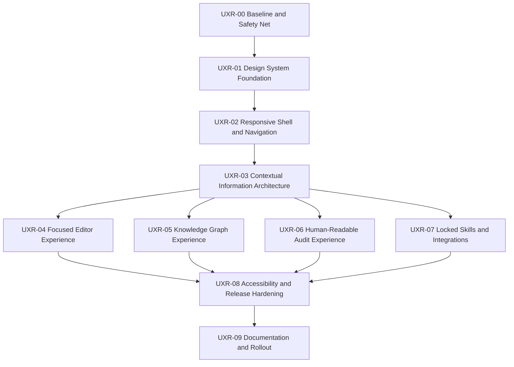

# tkxel Vault UI/UX Redesign Execution Plan

**Status:** Approved — executing one epic at a time with review gates
**Plan version:** 1.0  
**Prepared:** September 9, 2026  
**Implementation scope:** `apps/web-app`  
**Implementation authorization:** Approved by the product owner on September 9, 2026. Each epic still stops at its review gate before the next epic begins.

## 1. Outcome

Transform the existing Vault Admin Web App from a dense, implementation-shaped interface into a professional, calm, task-oriented experience while preserving all current product capabilities and security boundaries.

The redesign will prioritize:

1. A usable experience from mobile through wide desktop.
2. One clear primary action per screen.
3. Progressive disclosure of advanced and destructive actions.
4. Contextual navigation instead of repeated controls.
5. Human-readable graph and audit experiences.
6. A maintainable, accessible component system.

## 2. Evidence and baseline

The plan is based on a live UI review at desktop, compact laptop, and mobile viewport sizes, plus inspection of the current React components and styles.

Key baseline findings:

- The application is usable on wide desktop, but header controls become clipped at compact laptop widths.
- At a 390px mobile viewport, the fixed sidebar leaves the editor as an unusably narrow strip.
- The same vault actions appear in the global header, sidebar, and screen content.
- The editor gives similar visual weight to draft, publish, diff, AI, promotion, and deletion actions.
- The locked skills catalog is duplicated between the sidebar and main content.
- The graph uses small nodes, low-contrast relationships, technical titles, and a large amount of uninformative empty space.
- Audit history exposes UUIDs, internal event names, exact machine timestamps, and raw JSON as primary content.
- The frontend contains approximately 657 inline style declarations across 21 TSX/CSS files, with no responsive media-query layer and no meaningful ARIA labeling layer.

Existing references:

- [Software Requirements Specification](file:///C:/Users/mubashir.ali/Desktop/tkxel_vault_SRS/tkxel_vault_SRS.md)
- [Product Requirements Document](file:///C:/Users/mubashir.ali/Desktop/tkxel_vault_SRS/tkxel_vault_PRD.md)
- [Blue Horizon design language](file:///C:/Users/mubashir.ali/Desktop/tkxel_vault_SRS/DESIGN.md)
- [Current UI QA report](file:///C:/Users/mubashir.ali/Desktop/tkxel_vault_SRS/docs/UI_QA_ISSUES_REPORT.md)
- [Current UI guide](file:///C:/Users/mubashir.ali/Desktop/tkxel_vault_SRS/docs/COMPLETE_UI_GUIDE.md)

## 3. Non-negotiable guardrails

Every epic must preserve these invariants:

- Open and Locked Vault modes remain visibly and functionally segregated.
- Locked Vault consumers never receive raw markdown, source, file listings, paths, or graph data.
- Locked Vault export remains unavailable for every role, including owners and administrators.
- Authorization continues to be enforced server-side; responsive hiding is never treated as access control.
- Markdown, YAML front matter, tags, aliases, and `[[wiki-links]]` retain round-trip fidelity.
- Wiki-link autocomplete remains responsive and resolves both titles and aliases.
- Page rename continues to update referencing wiki-links atomically.
- Timeline entries remain append-only.
- Graph performance continues to target 2,000 nodes in under three seconds at 60 fps.
- All state-changing actions and tool calls continue to emit append-only audit events.

## 4. Proposed experience architecture

### Global shell

- Left: product identity, vault switcher, vault mode indicator.
- Center: primary views — Notes, Graph, Audit. On mobile these become bottom navigation.
- Right: search or command launcher, notifications if introduced later, and user menu.
- Vault administration actions move into the vault switcher or a single Settings area.

### Notes view

- Collapsible note navigator on desktop; drawer on smaller layouts.
- Quiet editor header with title, compact properties summary, save state, and one primary Publish action.
- Advanced actions live in a `More` menu.
- Properties, backlinks, local graph, and timeline live in an optional inspector.

### Graph view

- Graph receives the maximum available canvas.
- Contextual graph controls replace the note-management sidebar.
- Selecting a node opens a details inspector with human-readable information and actions.

### Audit view

- Full-width activity view without the note navigator.
- Human-readable activity rows with technical details available on demand.

### Locked skills view

- One skill catalog, not parallel copies in the sidebar and content area.
- Security status remains explicit but concise.
- No raw locked content or export affordance is introduced.

## 5. Epic dependency map

The critical path is `UXR-00 → UXR-01 → UXR-02 → UXR-03 → feature epics → UXR-08 → UXR-09`.

## 6. Epic plan

### UXR-00 — Baseline, visual inventory, and regression safety net

**Execution status:** Complete — awaiting UXR-00 review gate approval.

**Goal:** Establish measurable behavior before restructuring the UI.

**Work:**

- Capture reference states for Open Notes, Open Graph, Open Audit, Locked Skills, and Locked Audit.
- Define supported viewport matrix: 390×844, 768×1024, 1024×768, 1280×720, and 1440×900.
- Add smoke coverage for vault switching, note selection, draft preservation, publish, graph navigation, audit filtering, and locked-mode restrictions.
- Add explicit security assertions that Locked Vault export and raw content remain unavailable.
- Record current bundle size and graph-render timings for comparison.
- Create a review checklist that will be reused at the end of every epic.

**Acceptance criteria:**

- All current critical workflows have a repeatable baseline check.
- Test fixtures contain no confidential locked skill source.
- Failures clearly distinguish presentation regressions from product/security regressions.
- Existing tests continue to pass before implementation begins.

**Likely files:** `apps/web-app/test/`, root verification scripts, and test configuration only.

**Estimate:** 1–2 engineering days.

**Review gate:** Approve baseline evidence before component restructuring.

---

### UXR-01 — Design system foundation and reusable primitives

**Execution status:** Complete — committed independently before responsive shell migration.

**Goal:** Replace scattered visual decisions with a small, consistent component and token layer.

**Work:**

- Extend tokens for typography, spacing, control sizes, focus rings, elevation, layout widths, and breakpoints.
- Introduce reusable primitives: `Button`, `IconButton`, `Menu`, `Badge`, `TextField`, `Select`, `Drawer`, `Dialog`, `Tooltip`, `EmptyState`, `PageHeader`, and `DataTable` foundations.
- Define action hierarchy: primary, secondary, quiet, and destructive.
- Establish 40px desktop and 44px touch control targets where appropriate.
- Move high-churn inline styling into component styles while avoiding a risky all-at-once rewrite.
- Preserve the existing Blue Horizon palette, with orange reserved for Locked Vault state and warnings.
- Document component usage and prohibited variants.

**Acceptance criteria:**

- New or modified screens use shared primitives instead of introducing new one-off button/input styles.
- Primary, secondary, destructive, disabled, hover, focus, and loading states are visually consistent.
- Focus indicators meet visible keyboard-navigation requirements.
- No behavior or authorization logic changes in this epic.

**Likely files:** `src/styles/tokens.css`, `src/styles/index.css`, new `src/components/ui/` components, and `DESIGN.md` after approval.

**Estimate:** 2–3 engineering days.

**Review gate:** Approve primitives and a representative component gallery before shell migration.

---

### UXR-02 — Responsive application shell and adaptive navigation

**Execution status:** Complete — adaptive shell, mobile drawer/navigation, overflow actions, and responsive AI inspector implemented.

**Goal:** Make the application usable across supported desktop, tablet, and mobile widths.

**Work:**

- Replace the fixed one-line header with an adaptive shell.
- Add desktop, compact, and mobile layout modes using CSS breakpoints and container-aware behavior.
- Make the sidebar collapsible on desktop and a modal drawer below 900px.
- Replace clipped header actions with a controlled overflow menu.
- Add mobile bottom navigation for Notes, Graph, and Audit.
- Ensure dialogs, menus, drawers, and toolbars remain inside the viewport.
- Convert the 360px AI drawer into an inspector on desktop and a sheet/full-screen panel on narrow screens.
- Account for safe viewport height and browser UI on mobile.

**Acceptance criteria:**

- No horizontal page overflow at any supported viewport.
- The editor remains comfortably readable at 390px width.
- All primary navigation and actions remain reachable at 200% browser zoom.
- Opening a drawer or menu traps focus appropriately and returns focus when closed.
- Responsive presentation does not reveal actions forbidden by role or vault mode.

**Likely files:** `AppShell.tsx`, `Sidebar.tsx`, `MarkdownEditor.tsx`, `NotesAiDrawer.tsx`, `index.css`, and new responsive layout components.

**Estimate:** 3–5 engineering days.

**Review gate:** Product review at all five target viewports.

---

### UXR-03 — Contextual information architecture and action hierarchy

**Execution status:** Complete — navigation and actions now follow the active workspace, with plain-language labels and one administration menu.

**Goal:** Reduce cognitive load by showing controls only where they are relevant.

**Work:**

- Remove repeated Share, MCP, encryption, and skill-management actions from unrelated surfaces.
- Define view-specific sidebars: Notes navigation, Graph controls, Audit filters, and Locked Skills categories.
- Move Import, Export, Access, and Integrations into a single vault administration location.
- Keep Locked Vault mode visible through a persistent compact mode badge and icon.
- Replace technical labels where a plain-language term communicates the same concept:
  - `Connect LLM (MCP)` → `Integrations`
  - `Audit History & Access Ledger` → `Activity & Audit`
  - `Promote to Locked Skill` → `Create protected skill`
- Keep protocol names such as MCP available in descriptions and setup screens for technical users.
- Define empty states around a single recommended next action.

**Acceptance criteria:**

- A routine notes user sees no more than one primary and two immediate secondary actions.
- No global or vault-management action appears in more than one persistent location.
- Graph and Audit no longer carry the Notes sidebar by default.
- Open and Locked Vault modes remain unmistakable without repeated explanatory banners.
- All renamed labels are reflected in automated tests and documentation.

**Likely files:** `AppShell.tsx`, `Sidebar.tsx`, `App.tsx`, modal launch points, and navigation tests.

**Estimate:** 2–4 engineering days.

**Review gate:** Approve the navigation map and action inventory before feature-screen changes.

---

### UXR-04 — Focused authoring and note inspector

**Execution status:** Complete — focused editor, note inspector, caret link picker, insert menu, application dialogs, and line-level diff implemented. Background autosave is intentionally deferred by ADR-012 until save-conflict and audit-coalescing semantics are defined.

**Goal:** Make writing the dominant editor experience while retaining advanced metadata, linking, versioning, and AI capabilities.

**Work:**

- Reduce the persistent editor header to title, save state, Publish, AI Assist, and `More`.
- Preserve the explicit draft/publish version model while introducing background draft saving; confirm the exact autosave contract before implementation.
- Move View Diff, Create Protected Skill, and Delete into the `More` menu.
- Replace the permanent Category/Aliases/Tags row with a compact properties summary and expandable inspector.
- Add inspector tabs for Properties, Links, Local Graph, and Timeline.
- Preserve incoming and outgoing link visibility required by FR-10.
- Anchor the `[[` picker to the current caret instead of a fixed editor offset.
- Add slash-command insertion for headings, table, callout, task list, and timeline entry.
- Replace native browser confirmations with accessible application dialogs.
- Improve diff presentation with line-level additions, removals, and unchanged context.
- Surface save, publish, conflict, and offline states without blocking the writing flow.

**Acceptance criteria:**

- Markdown and YAML front matter round-trip without data loss, including unknown custom fields.
- `[[` picker opens at the caret, supports keyboard use, and meets the existing response target.
- Incoming and outgoing links remain accessible within one interaction from the editor.
- Timeline entries remain append-only and cannot be edited through the note body.
- Draft and published states are clearly distinguishable.
- Destructive actions require an accessible confirmation and are not visually primary.

**Likely files:** `MarkdownEditor.tsx`, `WikiLinkPicker.tsx`, `DiffViewer.tsx`, `TimelineView.tsx`, `LocalGraphView.tsx`, `NotesAiDrawer.tsx`, and new inspector/menu/dialog components.

**Estimate:** 5–8 engineering days.

**Review gate:** Complete authoring walkthrough with note creation, linking, rename, draft, publish, diff, AI, and timeline flows.

---

### UXR-05 — Knowledge graph comprehension and exploration

**Execution status:** Complete — local/entire scopes, scalable filters, degree sizing, selection emphasis, note inspector, keyboard alternatives, legend, fit/reset controls, level of detail, and a synthetic 2,000-node benchmark implemented.

**Goal:** Turn the graph from a technical visualization into an effective discovery tool.

**Work:**

- Give the graph maximum canvas space and collapse unrelated navigation by default.
- Add `Local neighborhood` and `Entire vault` scopes, preserving the required two-hop view.
- Humanize technical note titles for display while retaining exact stored titles.
- Size nodes by connection degree within controlled minimum and maximum bounds.
- Strengthen edge visibility and distinguish selected, neighboring, and unrelated elements.
- Add a node details inspector with type, tags, backlinks, outgoing links, and Open in Note.
- Consolidate category chips into filter controls that scale to many custom types and tags.
- Add a clear legend, result count, fit-to-selection, and reset behavior.
- Apply zoom-level label rules and clustering/level-of-detail behavior for large graphs.
- Preserve drag, pan, zoom, connection creation, and keyboard-accessible alternatives.
- Benchmark render time and interaction smoothness with a synthetic 2,000-node fixture.

**Acceptance criteria:**

- Users can identify the selected node and its direct neighborhood without relying on color alone.
- Local view shows the active page and two-hop neighborhood correctly.
- A node can be found, inspected, opened, and linked without ambiguous gestures.
- Custom types and large tag sets do not overflow the toolbar.
- The 2,000-node performance requirement is met or any variance is documented and approved.
- Locked Vault graph data remains unavailable.

**Likely files:** `KnowledgeGraph.tsx`, `GraphToolbar.tsx`, `LocalGraphView.tsx`, graph tests, and new graph inspector/filter components.

**Estimate:** 5–8 engineering days.

**Review gate:** Demonstrate small, medium, and 2,000-node graphs plus keyboard alternatives.

---

### UXR-06 — Human-readable activity and audit experience

**Execution status:** Complete — readable event descriptions, authorized name resolution, relative/exact time, concise rows, technical evidence drawer, five-dimensional filters, pagination, alert treatment, and explicit CSV scope implemented.

**Goal:** Make routine security and operational review understandable without removing forensic detail.

**Work:**

- Rename the primary view to `Activity & Audit` while retaining its compliance purpose.
- Translate event codes into readable verbs and outcomes.
- Resolve known target identifiers to names where authorization permits.
- Display local/relative time with exact UTC time available on hover or in details.
- Replace raw metadata JSON with concise summaries and an expandable technical-details drawer.
- Add filters for person, activity, outcome, date range, and resource.
- Add pagination or virtualization for large event sets.
- Improve alert states for denied or suspicious operations without coloring all normal events alike.
- Retain audited CSV export while making export scope and status clear.

**Acceptance criteria:**

- A non-technical owner can understand normal activity without reading UUIDs or JSON.
- Exact immutable event data remains available for authorized forensic review.
- Filters operate with keyboard and screen-reader support.
- Large audit datasets do not create unbounded DOM tables.
- No identifier or target name is resolved when doing so would violate vault access rules.

**Likely files:** `AuditViewer.tsx`, audit mapping utilities, tests, and possibly read-only API response shaping if later approved.

**Estimate:** 3–5 engineering days.

**Review gate:** Review normal, denied, and unresolved-resource audit examples.

---

### UXR-07 — Locked skills catalog and integrations simplification

**Execution status:** Complete — single protected catalog, concise expandable protection guidance, compact health summary, client-neutral invocation copy, portable credential-free integration examples, and safe public skill summaries implemented.

**Goal:** Present protected skills and client integrations professionally without duplicating information or weakening zero-read protection.

**Work:**

- Remove the duplicate skill-card collection from the sidebar.
- Use the main catalog as the single source of skill discovery and management.
- Replace the long security explanation with a concise protected-state banner and expandable explanation.
- Consolidate status cards into a compact health summary when status is normal.
- Separate skill management from skill execution guidance.
- Rename `Copy Claude Prompt` to a client-neutral term such as `Copy invocation`, while showing the exact client syntax in the integration flow.
- Consolidate Claude, Cursor, Codex, and remote MCP setup under `Integrations`.
- Remove or parameterize workstation-specific paths and mask example credentials.
- Keep Add Skill, delete, access management, and other privileged actions role-gated and audited.

**Acceptance criteria:**

- Each skill appears once in the persistent catalog experience.
- No screen exposes source, file structure, raw markdown, secrets, or locked content.
- Locked export is omitted or clearly unavailable and cannot be invoked.
- Integration instructions use portable placeholders and do not expose local usernames or plaintext credentials.
- Copy actions provide clear feedback without changing the system clipboard unexpectedly outside user initiation.

**Likely files:** `App.tsx`, `Sidebar.tsx`, `AddSkillModal.tsx`, `ConvertNoteToSkillModal.tsx`, `McpConnectModal.tsx`, and related tests.

**Estimate:** 3–5 engineering days.

**Review gate:** Zero-read UI inspection plus owner/editor/consumer role walkthrough.

---

### UXR-08 — Accessibility, resilience, and release hardening

**Execution status:** Complete — shared dialog focus containment and restoration, keyboard-complete menus and tabs, accessible import controls, reduced-motion behavior, long-content wrapping, compact-viewport modal bounds, live assistive-technology inspection, and regression coverage implemented.

**Goal:** Verify the redesigned experience under real input, zoom, performance, error, and authorization conditions.

**Work:**

- Add accessible names to icon-only controls and relationships between labels, hints, and fields.
- Verify logical heading structure, landmarks, dialogs, menus, tabs, tables, and live status regions.
- Complete full keyboard walkthroughs for Notes, Graph, Audit, Locked Skills, and all dialogs.
- Verify color contrast and non-color status indicators.
- Test at 200% zoom, reduced motion, long titles, long email addresses, empty states, loading states, failures, and slow connections.
- Add responsive screenshot checks at the agreed viewport matrix.
- Run the complete monorepo test suite and production build.
- Run zero-read and export-denial regression checks.
- Resolve only regressions introduced or exposed by the redesign; unrelated defects remain separately tracked.

**Acceptance criteria:**

- Target WCAG 2.2 AA for redesigned workflows.
- No keyboard traps, inaccessible dialogs, or unreachable actions.
- No horizontal application overflow at supported widths or 200% zoom.
- All existing security, markdown-fidelity, graph, audit, and role tests pass.
- No critical or high-severity UI regression remains open.

**Likely files:** Cross-cutting frontend components, test suites, and QA scripts.

**Estimate:** 3–5 engineering days.

**Review gate:** Formal UI, accessibility, security-boundary, and regression sign-off.

---

### UXR-09 — Documentation, migration notes, and controlled rollout

**Execution status:** Complete (commit `6f3222d`) — synchronized COMPLETE_UI_GUIDE.md to redesigned responsive shell and ActionMenu hierarchy, resolved DEF-09 through DEF-12 in UI_QA_ISSUES_REPORT.md with production bundle advisory, added Application-Specific Patterns to DESIGN.md, updated PROJECT_MEMORY.md with Milestone 15 and ADR-010-016, created RELEASE_UI_UX_REDESIGN.md, and documented step-by-step ROLLBACK_PROCEDURES.md.

**Goal:** Keep project memory, user guidance, design guidance, and implementation reality synchronized.

**Work:**

- Update the complete UI guide with the approved navigation and workflows.
- Update the UI QA report and close or supersede findings with verification evidence.
- Update `DESIGN.md` with application-specific patterns and responsive rules.
- Record an ADR if the approved component-system or navigation architecture constitutes a durable structural decision.
- Update `PROJECT_MEMORY.md` only after implementation and verification are complete.
- Provide before/after screenshots and a concise operator release note.
- Roll out behind a reversible frontend feature flag if deployment risk warrants it.

**Acceptance criteria:**

- Documentation matches actual labels, locations, permissions, and behaviors.
- No guide instructs users to access controls that no longer exist.
- Project memory records only verified completion, not planned work.
- Rollback instructions are documented and tested when a feature flag is used.

**Likely files:** `docs/COMPLETE_UI_GUIDE.md`, `docs/UI_QA_ISSUES_REPORT.md`, `DESIGN.md`, `PROJECT_MEMORY.md`, and potentially `docs/adr/ADR-010-*.md`.

**Estimate:** 1–2 engineering days.

**Review gate:** Documentation parity and final product-owner acceptance.

## 7. Delivery slices

To reduce risk, the implementation should be reviewed in these slices:

| Slice | Included epics | User-visible result | Suggested approval point |
| :--- | :--- | :--- | :--- |
| A — Foundation | UXR-00, UXR-01 | Stable baseline and reusable visual primitives | Approve component direction |
| B — Simplification | UXR-02, UXR-03 | Responsive shell and substantially reduced chrome | Approve navigation and responsive behavior |
| C — Core workflows | UXR-04, UXR-05 | Focused writing and useful graph exploration | Approve primary product workflows |
| D — Administration | UXR-06, UXR-07 | Readable audit and simplified protected skills | Approve admin and locked-vault experience |
| E — Release | UXR-08, UXR-09 | Accessible, verified, documented release | Final sign-off |

## 8. Test matrix

Every applicable epic should be checked across:

| Dimension | Required coverage |
| :--- | :--- |
| Viewports | 390×844, 768×1024, 1024×768, 1280×720, 1440×900 |
| Zoom | 100%, 200% |
| Roles | Owner, Editor, Reader, Consumer/no web access where applicable |
| Vault modes | Open and Locked |
| Data states | Empty, normal, long names, many tags, large audit log, 2,000-node graph |
| Inputs | Mouse, keyboard, touch-sized viewport |
| Network | Normal, slow, API unavailable, save failure |
| Security | Cross-vault denial, locked export denial, no raw locked content |

## 9. Risks and mitigations

| Risk | Mitigation |
| :--- | :--- |
| Moving controls causes discoverability regression | Preserve commands in one predictable overflow menu and add contextual onboarding/help. |
| Autosave blurs draft versus published semantics | Keep explicit Publish and visible draft state; define conflict/offline behavior before implementation. |
| Style migration creates widespread regressions | Migrate by component and epic, backed by baseline screenshots and shared primitives. |
| Graph enhancements reduce performance | Benchmark every graph milestone with the 2,000-node fixture and use Canvas/WebGL level-of-detail rules. |
| Responsive hiding is mistaken for authorization | Keep all permission checks server-side and retain role tests. |
| Human-readable audit rows hide forensic detail | Preserve immutable raw event data in an authorized expandable details view and CSV export. |
| Current uncommitted work overlaps redesign files | Re-inspect diffs before every epic and avoid overwriting unrelated changes. |

## 10. Decisions requested from the reviewer

Implementation can proceed with the recommended defaults unless the reviewer changes them:

1. **Delivery model:** Approve and execute one epic at a time with a review gate after each epic. **Recommended.**
2. **Responsive target:** Full responsive administration experience, including mobile editing; no native mobile application.
3. **Draft behavior:** Background draft saving plus explicit Publish, with a visible save state.
4. **Navigation:** Notes, Graph, and Activity as primary views; Access, Import/Export, and Integrations under vault administration.
5. **Terminology:** Use plain-language labels first and retain technical protocol names inside details/setup flows.
6. **Visual direction:** Retain Blue Horizon colors and typography while making the application calmer, less bordered, and less dense.

## 11. Approval and execution protocol

- This document is the review artifact; it does not authorize implementation.
- The reviewer may approve all epics, approve a delivery slice, approve one epic, or request revisions.
- After approval, work starts with `UXR-00` unless the reviewer explicitly selects a different safe subset.
- Before each epic, current uncommitted changes will be rechecked to prevent accidental overwrite.
- Each epic ends with tests, a concise change summary, screenshots where useful, and a stop for review.
- No epic will be marked complete in `PROJECT_MEMORY.md` until its acceptance criteria have been verified.

## 12. Overall estimate

The full plan is approximately **25–42 engineering days** if completed sequentially by one engineer, depending mainly on editor autosave/conflict handling, graph refinement, and accessibility remediation. The first meaningful improvement—responsive shell plus simplified navigation—arrives after UXR-00 through UXR-03, estimated at **8–14 engineering days**.

These are implementation estimates, not calendar commitments. Scope can be reduced by approving only selected delivery slices.
